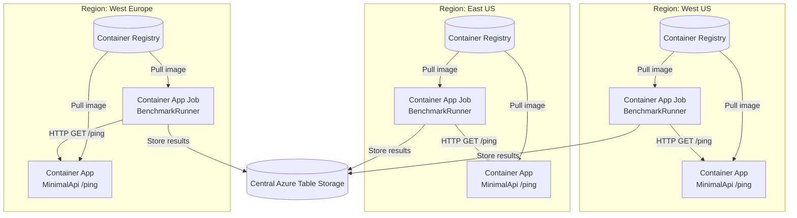

# Serverless Container Benchmark - Agent Architecture

This document describes how the Serverless Container Benchmark solution works, including its distributed architecture, component responsibilities, and execution flow.

## Solution Overview

The Serverless Container Benchmark is a distributed system designed to measure cold start performance of serverless containers across multiple Azure regions. It implements a "local testing" approach where each region runs its own benchmark agents to minimize network latency and provide accurate cold start measurements.

### Key Principles

- **Distributed Execution**: Each region has its own benchmark job that tests the local Container App endpoint
- **Minimized Network Latency**: Jobs only make requests to endpoints in the same region
- **Centralized Results**: All regions write results to a shared Azure Table Storage account for aggregation
- **Isolated Infrastructure**: Each region has its own Container Registry to eliminate cross-region image pulls during cold starts

## Architecture Components

### 1. MinimalApi (Target Application)

**Location**: `src/MinimalApi/`  
**Role**: The containerized application being benchmarked

- Simple ASP.NET Core web API with a `/ping` endpoint
- Returns JSON response: `{ "ok": true, "ts": "2024-01-01T12:00:00Z" }`
- Deployed as Azure Container App in each target region
- Pulls container image from region-local Azure Container Registry

### 2. BenchmarkRunner (Benchmark Agent)

**Location**: `src/BenchmarkRunner/`  
**Role**: The benchmarking engine that measures performance

- Console application that runs as Azure Container App Job
- Makes HTTP requests to the local MinimalApi endpoint
- Measures response times, distinguishes cold vs warm starts
- Collects detailed performance metrics (latencies, error rates, RPS)
- Stores results in centralized Azure Table Storage

#### Key Features:
- **Configurable Load Patterns**: Supports sequential or parallel request execution
- **Multiple Test Phases**: Separate cold start and warm-up phases with configurable delays
- **Multiple Endpoint Testing**: Can test different API paths in a single run
- **Detailed Metrics**: Captures min, max, average, P50, P90, P99 latencies

### 3. AppHost (Local Development Orchestrator)

**Location**: `src/AppHost/`  
**Role**: .NET Aspire orchestration for local development and testing

- Orchestrates MinimalApi and BenchmarkRunner for local development
- Provides development-time Azure Storage emulation
- Launches Aspire Dashboard for monitoring and debugging
- Enables end-to-end testing without Azure deployment

### 4. ServiceDefaults (Shared Configuration)

**Location**: `src/ServiceDefaults/`  
**Role**: Common configuration and observability setup

- Provides OpenTelemetry configuration for tracing and metrics
- Configures health checks and service discovery
- Adds resilience patterns (retries, circuit breakers)
- Shared across all components for consistent behavior

## Deployment Architecture



## Execution Flow

### 1. Initialization Phase
1. **Image Preparation**: Container images are built and pushed to region-specific Container Registries
2. **Infrastructure Deployment**: Container Apps and Container App Jobs are deployed per region
3. **Configuration**: Environment variables are set for each region's BenchmarkRunner

### 2. Benchmark Execution Phase
1. **Job Trigger**: Container App Jobs are triggered (manually or via scheduler)
2. **Cold Start Phase**: 
   - BenchmarkRunner waits for Container App to scale down (if needed)
   - Makes initial requests to trigger cold starts
   - Measures and records cold start latencies
3. **Delay Phase**: Configurable pause between cold and warm phases
4. **Warm Start Phase**:
   - Makes additional requests to warm instances
   - Measures and records warm start latencies
5. **Results Storage**: Performance data is written to Azure Table Storage

### 3. Analysis Phase
1. **Data Aggregation**: Results from all regions are collected from Table Storage
2. **Metrics Calculation**: Cross-region performance analysis and comparison
3. **Reporting**: Generate insights on cold start performance patterns

## Configuration Options

The BenchmarkRunner supports extensive configuration through environment variables:

### Core Configuration
- `RUN_ID`: Unique identifier for the benchmark run (auto-generated if not provided)
- `API_BASE_URL`: Base URL of the target API (defaults to service discovery)
- `API_PATH`: Single endpoint path to test (default: `/ping`)
- `API_PATHS`: Comma-separated list of endpoint paths (overrides API_PATH)

### Load Configuration
- `COLD_CALLS`: Number of cold start requests (default: 5)
- `WARM_CALLS`: Number of warm start requests (default: 10)
- `CONCURRENCY`: Number of concurrent requests (default: 10)
- `DELAY_BETWEEN_CALLS_SEC`: Seconds to wait between cold and warm phases (default: 30)

### Regional Configuration
- `REGION`: Region identifier for result categorization (e.g., "westus", "eastus")

### Storage Configuration
- `BENCHMARK_TABLE`: Azure Table Storage table name (default: "BenchmarkResults")
- Azure Table Storage connection configured via Aspire service bindings

## Data Model

### BenchmarkResult Schema
Each benchmark execution generates detailed performance records:

```csharp
{
    RunId: string,              // Unique run identifier
    Timestamp: DateTimeOffset,  // When the measurement was taken
    Path: string,              // API endpoint path tested
    Phase: string,             // "Cold", "Warm", or "Total"
    
    // Request Metrics
    Sent: int,                 // Number of requests sent
    Ok: int,                   // Number of successful responses
    Errors: int,               // Number of failed requests
    
    // Performance Metrics
    ElapsedSeconds: double,    // Total execution time
    Rps: double,              // Requests per second
    MinMs: double,            // Minimum latency
    P50Ms: double,            // 50th percentile latency
    AvgMs: double,            // Average latency
    P90Ms: double,            // 90th percentile latency
    P99Ms: double,            // 99th percentile latency
    MaxMs: double,            // Maximum latency
    
    // Context
    BaseUri: string,          // Target API base URL
    Concurrency: int,         // Concurrent request count
    ColdCalls: int,           // Cold start request count
    WarmCalls: int,           // Warm start request count
    Region: string            // Region identifier
}
```

### Storage Structure
- **Partition Key**: RunId (groups all results from a single benchmark run)
- **Row Key**: `{Path}:{Phase}:{Timestamp}:{Guid}` (ensures uniqueness and ordering)
- **Table Name**: Configurable (default: "BenchmarkResults")

## Results Interpretation

### Cold Start Metrics
- **P99 Latency**: Critical for understanding worst-case user experience
- **P50 Latency**: Represents typical cold start performance
- **Success Rate**: Percentage of requests that didn't fail during cold starts

### Warm Start Metrics
- **Baseline Performance**: Shows optimal performance when containers are warm
- **Consistency**: Lower variance indicates more predictable performance

### Cross-Region Analysis
- **Regional Variations**: Compare cold start performance across different Azure regions
- **Image Pull Impact**: Analyze correlation between region-local registries and performance
- **Load Pattern Effects**: Compare sequential vs. concurrent request patterns

## Local Development

The solution includes full local development support via .NET Aspire:

1. **Prerequisites**: .NET 8+ SDK, Aspire CLI
2. **Run Command**: `aspire run --project src/AppHost/AppHost.csproj`
3. **Access**: API available at http://localhost:8080, Aspire Dashboard auto-opens
4. **Storage**: Uses Azure Storage Emulator for local development

## Extensibility

The architecture supports several extension points:

### Custom Endpoints
- Add new API paths via `API_PATHS` configuration
- Implement custom endpoint logic in MinimalApi

### Additional Metrics
- Extend BenchmarkResult model for new measurements
- Modify BenchmarkRunner to collect additional data points

### Alternative Storage
- Implement custom `ITableStorageService` for different storage backends
- Add support for metrics databases or time-series stores

### Multi-Cloud Support
- Adapt Container App Jobs to other serverless platforms
- Implement platform-specific service discovery and configuration

## Best Practices

### Deployment
- Use infrastructure-as-code (Bicep/Terraform) for consistent multi-region deployment
- Automate container image builds and registry distribution
- Implement blue-green deployment for benchmark infrastructure updates

### Execution
- Schedule benchmark runs during low-traffic periods
- Use consistent load patterns across regions for fair comparison
- Monitor Azure Container Apps scaling metrics during benchmarks

### Analysis
- Aggregate results across multiple runs for statistical significance
- Account for Azure platform variability in performance baselines
- Consider time-of-day and regional load effects on results