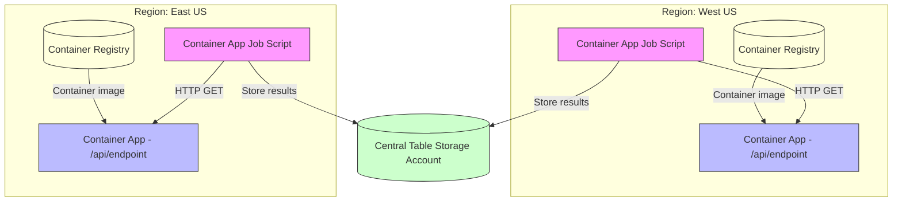

# Serverless Container Benchmark

This Serverless Container Benchmark is inspired by the [CloudRepublic Serverless Function Benchmark](https://serverlessbenchmark.cloudrepublic.nl/).

It measures the cold start performance of serverless containers running on [Azure Container Apps](https://azure.microsoft.com/en-us/products/container-apps) in multiple regions.

## Why?

Cold start performance is a critical aspect of serverless architectures, as it directly impacts the user experience. By benchmarking the cold start times of serverless containers across different regions, we can identify what workloads are acceptable to run serverless and which ones should have minimum resource guarantees.

This benchmark is not a critique on the Azure Container Apps platform, but rather an exploration of the trade-offs involved in serverless computing.

## Architecture

This solution is built around a single Container App Job (a script) that issues HTTP GET requests to multiple Container App HTTP endpoints deployed in different regions to measure cold start performance.

Below is a Mermaid diagram illustrating the architecture, now simplified to two regions. Each region has its own Container App Job that invokes its local endpoint, the Container App pulls its image from a region-local Container Registry, and results are written to a centralized Table Storage account:

Notes:
- Each region has its own Container App Job that invokes its local endpoint, minimizing cross-region latency.
- Each Container App pulls its image from a Container Registry hosted in the same region to reduce image pull latency during cold starts.
- Each job writes its measurements to a centralized Azure Table Storage account for aggregation.
- Jobs can perform requests sequentially or in parallel to simulate different load patterns.
- Use query parameters or headers to vary requests per-region (e.g., warm-up vs. benchmark runs).
- Collect response times and status codes for cold start analysis in each region.
- Aggregate results from all regions for comprehensive analysis.

Suggested result schema (Table Storage):
- Region: string (e.g., "westus", "eastus", "westeurope")
- TimeStamp: DateTimeOffset
- LatencyMs: end-to-end latency in milliseconds
- ColdStart: boolean flag (heuristic or server-reported)

## Run locally with .NET Aspire

This repo includes an Aspire AppHost (`src/AppHost`) that orchestrates the Minimal API and the Benchmark Runner and launches the Aspire Dashboard.

Prereqs:
- .NET 8 SDK installed (recommended). A `global.json` is provided to prefer .NET 8.
- Aspire CLI installed as a .NET global tool: `dotnet tool install -g aspire`

Run:
- From the repo root, run: `aspire run --project src/AppHost/AppHost.csproj`
- The dashboard will open automatically. The API is exposed on http://localhost:8080.

Notes:
- The AppHost config enables `DOTNET_ASPIRE_ALLOW_UNSECURED_TRANSPORT=true` for local development so you don't need HTTPS dev certs.
- If you have only .NET 10 preview SDK installed, you may be prompted to install the `aspire` workload. Prefer using .NET 8 to avoid that on local machines.

## CI/CD Pipeline

This repository includes a comprehensive CI/CD pipeline with GitHub Actions for both application and infrastructure deployment:

### Application Workflows

#### Pull Request Workflow (`.github/workflows/pr.yml`)
- **Trigger**: Pull requests to `main` branch (application code changes)
- **Actions**: 
  - Build solution with .NET 9.0
  - Run all unit tests with code coverage
  - Validate Docker builds (without pushing)
  - Upload test results as artifacts

#### Main Branch Workflow (`.github/workflows/main.yml`)
- **Trigger**: Pushes to `main` branch (application code changes)
- **Actions**:
  - Build solution with .NET 9.0
  - Run all unit tests with code coverage
  - Build Docker containers for both components
  - Push to Azure Container Registry (if configured)

### Infrastructure Workflows

#### Infrastructure What-If (`.github/workflows/infrastructure-whatif.yml`)
- **Trigger**: Pull requests with changes to `deploy/**`
- **Actions**:
  - Validate Bicep templates
  - Run Azure deployment what-if analysis
  - Comment PR with infrastructure changes preview

#### Infrastructure Deploy (`.github/workflows/infrastructure-deploy.yml`)
- **Trigger**: Pushes to `main` branch with changes to `deploy/**`
- **Actions**:
  - Validate and deploy Bicep templates
  - Deploy Azure infrastructure (Container Apps, ACRs, Storage, etc.)
  - Output deployment results

### Container Images
Two Docker images are built:
- **serverless-benchmark-api**: MinimalApi web service
- **serverless-benchmark-runner**: BenchmarkRunner console application

### Azure Setup with OIDC Authentication

The pipeline uses OpenID Connect (OIDC) federated identity for secure, credential-less authentication with Azure.

**How It Works:**

The application CI/CD workflow automatically discovers and deploys to all Azure Container Registries in the `serverless-container-benchmark` resource group. This design ensures:
- No hardcoded registry names - the workflow queries Azure dynamically
- Automatic deployment to all regional ACRs created by infrastructure deployment
- Seamless integration between infrastructure and application workflows

**Workflow Integration:**

1. **Infrastructure First**: Run the infrastructure deployment workflow to create the Azure resources (resource group, regional ACRs, Container Apps, etc.)
2. **Automatic Discovery**: The application workflow automatically finds all ACRs in the resource group
3. **Multi-Region Push**: Container images are built once and pushed to all regional registries

**Required Secrets:**
- `AZURE_CLIENT_ID`: Azure AD application client ID
- `AZURE_TENANT_ID`: Azure AD tenant ID
- `AZURE_SUBSCRIPTION_ID`: Your Azure subscription ID

**Setup Steps:**
1. Create an Azure AD application and service principal
2. Configure federated identity credentials for your GitHub repository
3. Grant appropriate RBAC roles:
   - `Contributor` role on the subscription (for infrastructure deployment)
   - `AcrPush` role on container registries (for pushing images)

For detailed setup instructions, see `docs/azure-oidc-setup.md`.

