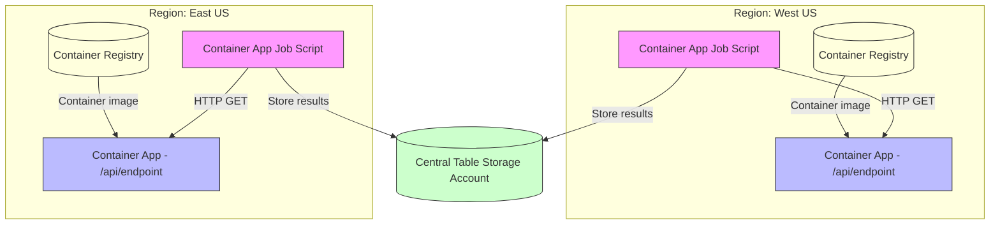

# Serverless Container Benchmark

This Serverless Container Benchmark is inspired by the [CloudRepublic Serverless Function Benchmark](https://github.com/CloudRepublic/CloudRepublic.BenchMark).

It measures the cold start performance of serverless containers running on [Azure Container Apps](https://azure.microsoft.com/en-us/products/container-apps) in multiple regions.

## Architecture

This solution is built around a single Container App Job (a script) that issues HTTP GET requests to multiple Container App HTTP endpoints deployed in different regions to measure cold start performance.

Below is a Mermaid diagram illustrating the architecture, now simplified to two regions. Each region has its own Container App Job that invokes its local endpoint, the Container App pulls its image from a region-local Container Registry, and results are written to a centralized Table Storage account:

Notes:
- Each region has its own Container App Job that invokes its local endpoint, minimizing cross-region latency.
- Each Container App pulls its image from a Container Registry hosted in the same region to reduce image pull latency during cold starts.
- Each job writes its measurements to a centralized Azure Table Storage account for aggregation.
- Jobs can perform requests sequentially or in parallel to simulate different load patterns.
- Use query parameters or headers to vary requests per-region (e.g., warm-up vs. benchmark runs).
- Collect response times and status codes for cold start analysis in each region.
- Aggregate results from all regions for comprehensive analysis.

Suggested result schema (Table Storage):
- Region: string (e.g., "westus", "eastus", "westeurope")
- TimeStamp: DateTimeOffset
- LatencyMs: end-to-end latency in milliseconds
- ColdStart: boolean flag (heuristic or server-reported)

