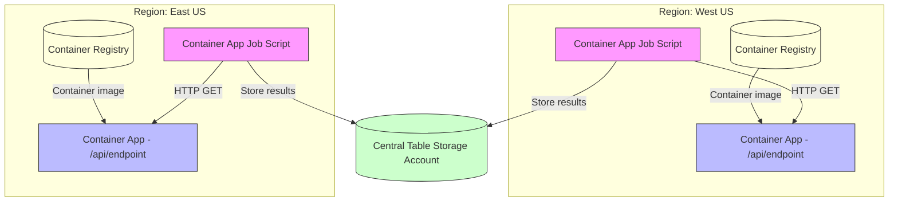

# Serverless Container Benchmark

This Serverless Container Benchmark is inspired by the [CloudRepublic Serverless Function Benchmark](https://serverlessbenchmark.cloudrepublic.nl/).

It measures the cold start performance of serverless containers running on [Azure Container Apps](https://azure.microsoft.com/en-us/products/container-apps) in multiple regions.

## Why?

Cold start performance is a critical aspect of serverless architectures, as it directly impacts the user experience. By benchmarking the cold start times of serverless containers across different regions, we can identify what workloads are acceptable to run serverless and which ones should have minimum resource guarantees.

This benchmark is not a critique on the Azure Container Apps platform, but rather an exploration of the trade-offs involved in serverless computing.

## Architecture

This solution is built around a single Container App Job (a script) that issues HTTP GET requests to multiple Container App HTTP endpoints deployed in different regions to measure cold start performance.

Below is a Mermaid diagram illustrating the architecture, now simplified to two regions. Each region has its own Container App Job that invokes its local endpoint, the Container App pulls its image from a region-local Container Registry, and results are written to a centralized Table Storage account:

Notes:
- Each region has its own Container App Job that invokes its local endpoint, minimizing cross-region latency.
- Each Container App pulls its image from a Container Registry hosted in the same region to reduce image pull latency during cold starts.
- Each job writes its measurements to a centralized Azure Table Storage account for aggregation.
- Jobs can perform requests sequentially or in parallel to simulate different load patterns.
- Use query parameters or headers to vary requests per-region (e.g., warm-up vs. benchmark runs).
- Collect response times and status codes for cold start analysis in each region.
- Aggregate results from all regions for comprehensive analysis.

Suggested result schema (Table Storage):
- Region: string (e.g., "westus", "eastus", "westeurope")
- TimeStamp: DateTimeOffset
- LatencyMs: end-to-end latency in milliseconds
- ColdStart: boolean flag (heuristic or server-reported)

## Run locally with .NET Aspire

This repo includes an Aspire AppHost (`src/AppHost`) that orchestrates the Minimal API and the Benchmark Runner and launches the Aspire Dashboard.

Prereqs:
- .NET 8 SDK installed (recommended). A `global.json` is provided to prefer .NET 8.
- Aspire CLI installed as a .NET global tool: `dotnet tool install -g aspire`

Run:
- From the repo root, run: `aspire run --project src/AppHost/AppHost.csproj`
- The dashboard will open automatically. The API is exposed on http://localhost:8080.

Notes:
- The AppHost config enables `DOTNET_ASPIRE_ALLOW_UNSECURED_TRANSPORT=true` for local development so you don't need HTTPS dev certs.
- If you have only .NET 10 preview SDK installed, you may be prompted to install the `aspire` workload. Prefer using .NET 8 to avoid that on local machines.

## CI/CD Pipeline

This repository includes a complete CI/CD pipeline implemented with GitHub Actions that supports:

### Pull Request Workflow
- **Trigger**: Pull requests to `main` branch
- **Actions**: 
  - Build solution with .NET 9.0
  - Run all unit tests
  - Validate Docker builds (without pushing)
  - Upload test results as artifacts

### Main Branch Workflow  
- **Trigger**: Pushes to `main` branch
- **Actions**:
  - Build solution with .NET 9.0
  - Run all unit tests
  - Build Docker containers for both components
  - Push to Azure Container Registry (if configured)

### Container Images
Two Docker images are built:
- **serverless-benchmark-api**: MinimalApi web service
- **serverless-benchmark-runner**: BenchmarkRunner console application

### Azure Container Registry Setup
To enable automatic container pushes to Azure Container Registry:

1. Set the `REGISTRY_NAME` environment variable in `.github/workflows/main.yml` to your ACR URL (e.g., `myregistry.azurecr.io`)
2. Configure the following repository secrets:
   - `ACR_USERNAME`: Azure Container Registry username
   - `ACR_PASSWORD`: Azure Container Registry password

If `REGISTRY_NAME` is not configured, the workflow will build containers but skip the push step, displaying a notice with setup instructions.

